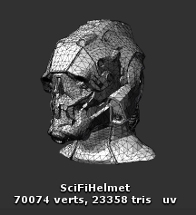

# UniGLTF

[glTF](https://github.com/KhronosGroup/glTF) importer

* Unityt5.6.3
* glTF-2.0


* [license](LICENSE)

## Install

* import [unitypackage](https://github.com/ousttrue/UniGLTF/releases)

### developer

* create Unity new project
* clone UniGLTF repose in Assets folder

## Usage

* drop gltf folder or glb file int Assets folder

or

* use [Assets] - [gltf] - [import] menu

## Json

### Deserialize

UnityEngine.JsonUtlity is enough.

### Serrialize

It is necessary to selectively output property.
UnityEngine.JsonUtlity is not enough.

## Coordinate conversion(Right-handed and Left-handed)

* Both GLTF and Unity is, x-right and y-up.
* GLTF is z-backward
* Unity is z-forward

```cs
Vector3 reversed = new Vector3(src.x, src.y, -src.z);
```

```cs
float angle;
Vector3 axis;
src.ToAngleAxis(out angle, out axis);
Quaternion reversed = Quaternion.AngleAxis(-angle, new Vector3(axis.x, aixs.y, -axis.z));
```

```cs
var src = new Matrix4x4();
src.m00 = values[0];
src.m10 = values[1];
src.m20 = values[2];
src.m30 = values[3];
src.m01 = values[4];
src.m11 = values[5];
src.m21 = values[6];
src.m31 = values[7];
src.m02 = values[8];
src.m12 = values[9];
src.m22 = values[10];
src.m32 = values[11];
src.m03 = values[12];
src.m13 = values[13];
src.m23 = values[14];
src.m33 = values[15];

// ?
Matrix4x4 reversed = src;
m.m20 *= -1;
m.m21 *= -1;
m.m22 *= -1;
m.m23 *= -1;
```

This should be done in global coordinate, but animation curve contains local coordinate.

## Importer

* [x] asset(ScriptedImporter) (Unity-2017 or new)
* [x] asset(AssetPostprocessor.OnPostprocessAllAssets) (Unity-5.6)

* runtime [Assets] - [gltf] - [import]

### Sample Models

* https://github.com/KhronosGroup/glTF-Sample-Models

Exclude SciFiHelmet(70074vertices), all model can import.

[Mesh.IndexFormat(from 2017.3)](https://docs.unity3d.com/ScriptReference/Mesh-indexFormat.html) allows a huge mesh, Otherwise mesh division required.



## Exporter

* asset([right click] - [gltf] - [export]
* runtime
* [validation](http://github.khronos.org/glTF-Validator/)

## Features & ToDo

* [x] gltf
* [x] glb
* [ ] Sample scene and model
* [ ] Separate editor code
* [x] Unity-5.6 compatibility

### material & texture

|features     |importer|exporter|memo     |
|-------------|--------|--------|---------|
|color        |o       |o       |/materials/#/pbrMetallicRoughness/baseColorFactor
|color texture|o       |o       |/materials/#/pbrMetallicRoughness/baseColorTexture
|sampler      |o       |o       |/samplers
|multi uv     |
|PBR          |

```cs
var texture=new Texture2D(2, 2);
texture.LoadImage(bytes, true);
texture.wrapModeU = TextureWrapMode.Clamp;
texture.wrapModeV = TextureWrapMode.Clamp;
texture.filterMode = FilterMode.Point;

var shader=Shader.Find("Standard");
var material=new Material(shader);
material.color = pbrMetallicRoughness.baseColorFactor;
material.mainTexture = texture;
```

### mesh

|features     |importer|exporter|memo     |
|-------------|--------|--------|---------|
|positions    |o       |o       |/meshes/#/primitives/#/attributes/POSITION, reverse-z
|normals      |o       |o       |/meshes/#/primitives/#/attributes/NORMAL, reverse-z
|uv           |o       |o       |/meshes/#/primitives/#/attributes/TEXCOORD_0, reverse-y
|tangent      |        |        |/meshes/#/primitives/#/attributes/TANGENT, ?
|primitive    |o       |o       |todo:sharing attributes|

```cs
var mesh=new Mesh();
mesh.vertices = positions;
mesh.normals = normals;
mesh.uv = uv;

mesh.subMeshCount=primitiveCount;
for(int i=0; i<primitiveCount; ++i)
{
    mesh.setTriangles(primitive[i].indices, i);
}    
```

#### morph

|features     |importer|exporter|memo     |
|-------------|--------|--------|---------|
|blend shape  |o       |        |/meshes/#/primitives/#/targets
|name ?

```cs
foreach(var target in targets)
{
    mesh.addBlendSapeFrame(target.name, 100.0f, target.POSITION, target.NORMAL, target.TEXCOORD_0);
}
```

#### skin

* Matrix4x4 Behavior may be different between Unity 2017 and Unity 5.6
* Because of the bindmatrix, The animation of models with different inverseBindMatrices and node hierarchy break

```cs
// workaround. calculate bindMatrices from hierarchy
var hipsParent = nodes[skin.skeleton].Transform.parent;
var bindMatrices = joints.Select(y => y.worldToLocalMatrix * hipsParent.localToWorldMatrix).ToArray();
mesh.bindposes = bindMatrices;
```

|features     |importer|exporter|memo     |
|-------------|--------|--------|---------|
|boneweight   |o       |o       |/meshes/#/primitives/#/attributes/(JOINTS_0|WEIGHTS_0)
|bindmatrix   |        |        |/skins/#/inverseBindMatrices
|skeleton     |o       |        |/skins/#/skeleton
|joints       |o       |        |/skins/#/joints

```cs
mesh.boneWeights=boneWeights;
mesh.bindposes=inverseBindMatrices

var skin=go.addCompoenent<SkinnedMeshRenderer>();
skin.bones=joints;
skin.rootBone=skeleton;
```

### node

|features     |importer|exporter|memo     |
|-------------|--------|--------|---------|
|translation  |o       |o       |/nodes/#/tlanslation, reverse-z
|rotation     |o       |o       |/nodes/#/rotation, reverse-z
|scale        |o       |o       |/nodes/#/scale
|matrix       |o       |-       |/nodes/#/matrix, reverse-z

### animation

* reverse-z. May be in global coordinate...
* AnimationUtility.GetCurveBindings

|features     |importer|exporter|memo     |
|-------------|--------|--------|---------|
|TRS          |o       |o       |/anmations/#/channels/#/target/path == translation|rotation|scale
|blendshape   |o       |        |/animation/#/channels/#/target/path == weight
|interpolation|

```cs
foreach (var binding in AnimationUtility.GetCurveBindings(clip))
{
    // Curve binding acquisition is possible only in editor mode
    var curve = AnimationUtility.GetEditorCurve(clip, binding);
    foreach(var key in curve.keys)
    {

    }
}
```

#### legacy

for Animation component.

```
var clip=new AnimationClip();
clip.legacy=true;

var animation = go.AddComponent<Animation>();
animation.clip = clip;
```

#### generic

for Animator component.

#### humanoid

for Animator component. require humanoid avatar.

### not implemented

* Camera
* Light

## Experimental ScriptedImporter for Unity2017

[ScriptedImporter](https://docs.unity3d.com/ScriptReference/Experimental.AssetImporters.ScriptedImporter.html)

* Unity2017.3.0f3


* [x] separate Unity-2017's ScriptedImporter
* [ ] crash in unity2017's ScriptedImporter when reimport. workaround, move target file to out of Assets. Launch unity, then move the file to Assets folder.

AssetPostprocessor version is more stable.

## Humanoid Helper

* model position is origin
* model look at +z orientation
* model root node rotation is Quatenion.identity


|features     |importer|exporter|memo     |
|-------------|--------|--------|---------|
|avatar       |o       |        |
|avatar params|        |        |
|bone name    |        |        |rename to bone name

